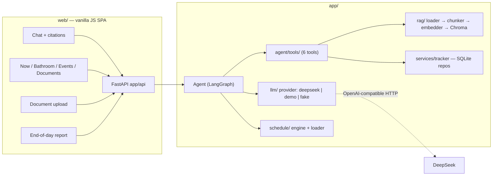

# SubPilot

An AI agent that helps **substitute teachers** get through their day at an unfamiliar school: it knows the bell schedule, can answer policy questions from uploaded documents (with citations), tracks bathroom passes and classroom events, and writes the end-of-day note for the regular teacher.

Built as a 7-phase portfolio project — local-first, deterministic where it matters, no silent degradation. **Status: complete.**

## Features

- **"What should I do now?"** — live hero answer + Now panel driven by a deterministic bell-schedule engine (no LLM involved in time math).
- **Agent chat** — LangGraph loop (`contextualize → agent ⇄ tools`) with session memory; RAG answers carry source citations rendered as footnotes in the UI.
- **Document RAG** — upload PDF / DOCX / TXT / MD; parsed, chunked, embedded locally (sentence-transformers + Chroma), retrieved with `filename · page · heading` citations. No hits → the agent says so instead of inventing policy.
- **Action tools** — bathroom passes (start/end/status, one open pass per student, SQLite-enforced) and classroom events (append-only factual log, period auto-resolved from the schedule). Timestamps come from an injected clock — the LLM never supplies times.
- **End-of-day report** — substitute note composed only from the real event log + schedule context; the prompt forbids invented events.
- **Zero-key Demo mode** — a deterministic provider that runs the real retrieval loop, so the whole app demos with no API key.

## Architecture



Design principles:

- **Deterministic where it matters** — schedule state, timestamps, and event logs never pass through the LLM.
- **Explicit failure** — missing config returns 503 with the exact variable names; LLM runtime failures return 502; a missing schedule file degrades gracefully with a UI note, never silently.
- **Injected clock** — `now` flows from the caller (API → agent → tools); nothing reads the wall clock deep in the stack.
- **Thin API, no framework UI** — vanilla JS renders everything via `textContent` (XSS-safe).

## Tech stack

| Layer | Choice |
|---|---|
| Agent loop | LangGraph (`StateGraph`, `ToolNode`, `tools_condition`) |
| LLM | Any OpenAI-compatible endpoint (DeepSeek default) via a small `BaseChatModel` provider layer |
| Retrieval | pypdf / python-docx → rule-based chunker → `all-MiniLM-L6-v2` → Chroma (cosine, local persistent) |
| Backend | FastAPI + uvicorn |
| Data | stdlib SQLite (passes, events), JSON (schedule, document registry) |
| Frontend | Vanilla HTML/CSS/JS, no build step |
| Tests | pytest — unit + API + one real-model integration test |

## Quick start (real provider)

```bash
git clone <repo> && cd subpilot
uv sync                                   # or: pip install -e .
cp .env.example .env                      # set SUBPILOT_LLM_MODEL / _API_KEY / _BASE_URL
# set SUBPILOT_TIMEZONE=America/New_York and drop a schedule into data/schedule.json:
#   {"days": {"2026-09-10": [{"name": "P1", "kind": "class", "start": "08:00", "end": "08:45", "subject": "Math"}]}}
.venv/bin/uvicorn app.main:app --reload --port 8000
```

Open <http://127.0.0.1:8000> — chat, upload a handbook PDF, watch the panels.

## Demo mode — no API key

```bash
python scripts/demo.py
```

One command: seeds this week's bell schedule, ingests a sample school handbook into the real RAG pipeline (first run downloads the ~90 MB embedding model once), and serves the app with the deterministic `demo` provider — no external calls, no keys. Then try:

- *"What is the bathroom pass policy?"* → real retrieval, answer with citation footnote.
- *"What does the handbook say about fire drills?"*
- The Now panel shows the seeded schedule; bathroom/event panels react to chat actions.
- Anything the handbook doesn't cover → the agent says so plainly.

## Configuration

| Variable | Meaning |
|---|---|
| `SUBPILOT_LLM_PROVIDER` | `deepseek` (default) · `demo` (zero-key) · `fake` (tests) |
| `SUBPILOT_LLM_MODEL` / `_API_KEY` / `_BASE_URL` | OpenAI-compatible endpoint — all three required for `deepseek`, nothing hardcoded |
| `SUBPILOT_TIMEZONE` | IANA name (e.g. `America/New_York`) — the schedule engine raises without an explicit tz rather than falling back to server-local time |
| `SUBPILOT_DATA_DIR` | Data root (Chroma, SQLite, model cache, schedule.json) — default `./data` |

## Tests

```bash
uv run pytest                    # fast unit/API tests, no network
uv run pytest -m integration     # real-embedding end-to-end test (first run downloads the model)
```

Latest run: **170 passed + 1 integration passed (1 skipped pending model download)**, plus a 10-check end-to-end smoke covering chat→agent→tool→cited answer, upload→RAG, all four panels, report, and the 502 error path.

## Deployment (free / low-cost)

**Render free tier** — one click:

1. Push this repo to GitHub (public or private).
2. Render → *New → Blueprint* → select the repo. `render.yaml` provisions a free Docker web service with the `demo` provider and a `/healthz` health check.
3. Open the `.onrender.com` URL.

Notes: free tier has an ephemeral disk, so uploaded documents reset on redeploy — fine for a portfolio demo. For a persistent or real-LLM deployment, set `SUBPILOT_LLM_PROVIDER=deepseek` + the three endpoint vars in the Render dashboard and add a persistent disk for `SUBPILOT_DATA_DIR`. The Dockerfile pre-downloads the embedding model at build time so cold boots never time out.

Manual Docker:

```bash
docker build -t subpilot . && docker run -p 8000:8000 subpilot
```

## Project structure

```
app/
  agent/        LangGraph loop, session store, tools (retrieval + bathroom + events)
  api/          thin FastAPI layer (/api/chat, /api/status, /api/documents, /api/report)
  llm/          provider abstraction: deepseek / demo / fake
  rag/          loader → chunker → embedder → Chroma store → retriever
  schedule/     bell-schedule models, JSON loader, deterministic engine
  services/     SQLite repos (bathroom passes, events), document registry
web/            vanilla-JS UI (chat, panels, upload, report letter)
scripts/demo.py one-command demo seeding + launch
sample_data/    demo handbook
tests/          unit + API + one real-model integration test
```

## Portfolio blurb (resume-ready)

> **SubPilot** — *AI agent for substitute teachers* · Python, LangGraph, FastAPI, ChromaDB, SQLite, vanilla JS
>
> Designed and built an LLM agent that runs a substitute teacher's whole day: a LangGraph loop (`contextualize → agent ⇄ tools`) with six tools — cited RAG over school documents (PDF/DOCX parsing, local sentence-transformers embeddings, thresholded dense retrieval), bathroom-pass and classroom-event tracking backed by SQLite (one open pass per student enforced at the DB level), and a deterministic bell-schedule engine. Deliberately kept time, logs, and schedule state out of LLM hands: an injected clock stamps all events, and the end-of-day note is constrained to real logged events. Shipped a no-build-step vanilla-JS UI (chat with citation footnotes, live Now/Bathroom/Events panels, drag-and-drop upload, report letter) over a thin FastAPI API with explicit 503/502 error surfaces, a zero-API-key demo mode, Docker/Render deployment, and 169 passing tests.

## Security notes

- Secrets never enter the repo: `.env` and `data/` are gitignored; `.env.example` contains placeholders only; API keys are read strictly from the environment.
- The UI renders all dynamic content with `textContent` — no XSS surface; uploads are written to the data dir with sanitized names and unsupported types are rejected with 400.

## How it works (phase history, condensed)

1. **RAG pipeline** — local, offline retrieval: loader (PDF/DOCX/TXT/MD with explicit errors for scanned/empty files), rule-based chunker (~1000 chars, heading-aware), local embeddings cached under `data/models`, persistent Chroma store, cosine retrieval with a 0.30 threshold and `filename · page · heading` citations.
2. **Schedule engine** — date-keyed validated `Schedule`; `status_at(now)` returns `before_school / in_period / between_periods / after_school / no_classes` with current subject, minutes remaining, and next period. Period starts inclusive, ends exclusive; explicit timezone or raise.
3. **LLM + agent** — provider abstraction (`deepseek`/`demo`/`fake`); minimal LangGraph graph with tools injected as a parameter; deterministic `contextualize` node converts schedule state into system context (zero LLM); `retrieve_documents` tool with an explicit no-hits message.
4. **Action tools** — bathroom pass ×3 and classroom events ×2 over stdlib SQLite; business rules enforced in the repo layer (partial unique index on open passes); event periods resolved against the schedule engine.
5. **Web UI** — Morandi-toned single-page UI: hero + chat with source footnotes, status rail (Now timeline, Bathroom, Events, Documents dropzone), end-of-day report letter; 60s panel refresh + immediate refresh after chat actions.
6. **End-to-end integration** — chat/status/documents/report fully wired through the real agent, schedule engine, tracker, and RAG singletons; 502/503 error surfaces; loading states.
7. **Release & portfolio** — this README, zero-key demo mode, Dockerfile + Render blueprint, secrets audit, resume blurb.
